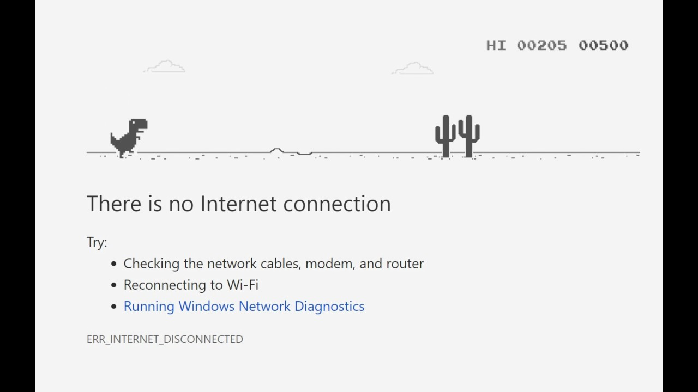

# Google-Dino-Run-using-8051-Microcontroller #

**Actual Google Dino Run game**

**A demo on 8051 board (PS: Since the board's 7 segment display was not working, I had to make the score board simulation on Proteus)**

.gif)

**Real demo on 8051 board***

%20(1).gif)
